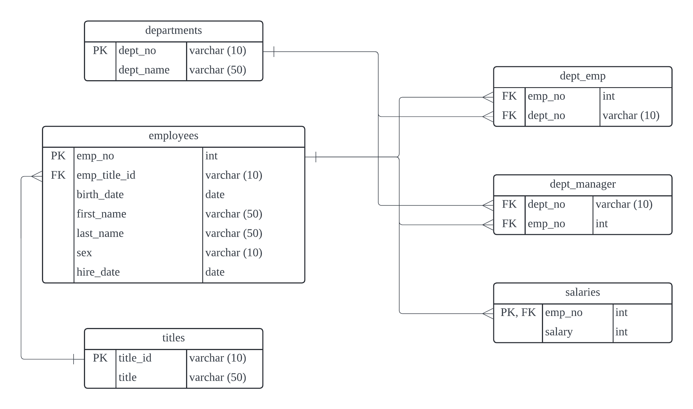

# Module-9-Challenge

## Data Modeling

After inspecting every CSV files in the 'data' folder, I used Lucidchart to sketch the Entity Relationship Diagram (ERD) below based on the fields in each file and their relationships. The ERD image is also saved as `employee_ERD.png` in the 'EmployeeSQL' folder.

## Data Engineering

I first created a database and then established the six tables with the necessary fields for importing data from the CSV files into the database. The SQL code for creating the tables is saved as `schema.sql` in the 'EmployeeSQL' folder, and the order in which I created the tables matches the order shown in the `schema.sql` file.

Please see the following details of each table:

1. Table 'departments'

    - dept_no: character varying(10), not null, and is the primary key of this table.
    - dept_name: character varying(50), not null.

2. Table 'titles'

    - title_id: character varying(10), not null, and is the primary key of this table.
    - title: character varying(50), not null.
    - This table was created before the 'employees' table because the field 'title_id' is referenced as a foreign key in the 'employees' table.

3. Table 'employees'

    - emp_no: integer, not null, and is the primary key of this table.
    - emp_title_id: character varying(10), not null, set as a foreign key referencing the field 'title_id' in the 'titles' table. Setting this field as a foreign key ensures that values exist in the 'titles' table and avoids any id that doesn't exist.
    - birth_date: date.
    - first_name: character varying(50), not null.
    - last_name: character varying(50), not null.
    - sex: character varying(10).
    - hire_date: date.

4. Table 'dept_emp'

    - emp_no: integer, not null, and set as a foreign key referencing the field 'emp_no' in the 'employees' table.
    - dept_no: character varying(10), not null, and set as a foreign key referencing the field 'dept_no' in the 'departments' table.

5. Table 'dept_manager'

    - dept_no: character varying(10), not null, and set as a foreign key referencing the field 'dept_no' in the 'departments' table.
    - emp_no: integer, not null, and set as a foreign key referencing the field 'emp_no' in the 'employees' table.

6. Table 'salaries'

    - emp_no: integer, not null, and set as a foreign key referencing the field 'emp_no' in the 'employees' table.
    - salary: integer, not null.
    - The field 'emp_no' is also the primary key of this table since this column is unique and the field 'salary' is dependent on it.

After creating all the tables, I loaded data from the corresponding CSV files into each table in the order in which the tables were created.

## Data Analysis

There are eight questions in this section. The SQL code for querying the answer is saved as `queries.sql` in the 'EmployeeSQL' folder.

## Resources

Resources that I referred to for completing this homework:

<https://chatgpt.com/>
